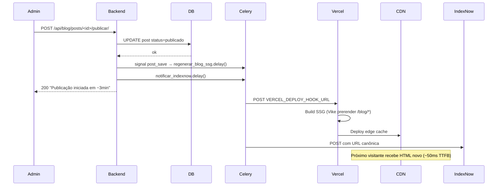

# clama.blog — App Django do blog do Clama

Feature de blog pastoral com SSG (Vike) no frontend e CRUD admin via DRF
no backend. Stack: Django 4.2 + DRF + Celery + Redis + Vercel Deploy Hook
+ IndexNow.

## Visão geral

| Camada | Responsabilidade |
|---|---|
| Backend (este app) | CRUD admin de posts, endpoints públicos cached, comentários/likes com rate limit, moderação, IP encriptado (LGPD), tasks Celery (Vercel rebuild + IndexNow notify) |
| Frontend (Vike) | SSG das rotas `/blog/*` no build; islands React para comentários/likes; editor Tiptap no admin |
| Infra | Vercel (frontend CDN + build hook), Railway (backend Django + Celery worker + beat), Redis (cache + Celery broker), PostgreSQL |

## Modelos

```mermaid
erDiagram
    Post ||--o{ Comentario : "tem"
    Post ||--o{ Reacao : "tem"
    User ||--o{ Post : "autor"
    User ||--o{ Comentario : "customer"
    User ||--o{ Reacao : "customer"
    User ||--o{ CustomerBanido : "banido"

    Post {
        UUID id PK
        slug slug "unique"
        string titulo
        text conteudo_html "sanitized"
        json conteudo_tiptap_json "source"
        string excerpt
        string meta_title
        string meta_description
        url imagem_capa_url
        choice status "rascunho|publicado"
        datetime data_publicacao
        bool historia_ilustrativa "FR57"
    }
    Comentario {
        UUID id PK
        FK post
        FK customer
        text conteudo "max 2000, plain"
        encrypted ip_address "LGPD"
        bool is_suspeito "filtro palavras"
    }
    Reacao {
        UUID id PK
        FK post
        FK customer
        choice tipo "like"
    }
    CustomerBanido {
        UUID id PK
        FK customer
        text motivo
        datetime banido_em
        FK banido_por
        datetime revogado_em "nullable"
        FK revogado_por "nullable"
    }
```

**Decisões-chave:**

- **`customer` é `users.User`** (não há model `Customer` separado no clama). Distinção é via flag `is_clama_admin`.
- **`Post.conteudo_html` é derivado** de `conteudo_tiptap_json` via `tiptap_json_to_html()` + `sanitize_post_html()`. Nunca editar `conteudo_html` direto — invariante mantida pelo `Post.save()` override.
- **`Comentario.ip_address` é encriptado** em repouso (LGPD/Marco Civil; retido por 180 dias, depois purgado via Celery beat).
- **`Reacao` tem UniqueConstraint** `(post, customer, tipo)` — previne dupla.
- **`CustomerBanido.revogado_em`** sinaliza banimento ativo (`NULL` = ativo).

## Endpoints REST

### Admin (`IsClamaAdmin`)

| Método | Path | Função |
|---|---|---|
| GET | `/api/blog/posts/` | Lista posts (paginated 20) |
| POST | `/api/blog/posts/` | Cria post (sanitiza Tiptap JSON) |
| GET/PATCH/PUT/DELETE | `/api/blog/posts/<uuid>/` | CRUD individual |
| POST | `/api/blog/posts/<uuid>/publicar/` | Transiciona p/ publicado + dispara signal |
| POST | `/api/blog/posts/<uuid>/despublicar/` | Transiciona p/ rascunho + dispara signal |
| GET | `/api/blog/admin/comments/` | Lista todos comentários (?status=suspeitos, ?post=slug) |
| DELETE | `/api/blog/admin/comments/<uuid>/` | Remove qualquer comentário |
| GET | `/api/blog/admin/banned-customers/` | Lista bans ativos |
| POST | `/api/blog/admin/banned-customers/` | Cria ban (idempotente) |
| DELETE | `/api/blog/admin/banned-customers/<int customer_id>/` | Revoga ban |

### Público (`AllowAny`)

| Método | Path | Função |
|---|---|---|
| GET | `/api/blog/public/posts/` | Lista publicados (paginated 12), `Cache-Control: max-age=300` |
| GET | `/api/blog/public/posts/<slug>/` | Detalhe por slug |
| GET | `/api/blog/posts/<slug>/comments/` | Lista comentários (max-age=10s; noindex se < 24h) |
| GET | `/sitemap.xml` | Sitemap XML (posts publicados) |
| GET | `/robots.txt` | Robots policy |

### Customer (`IsUnbannedCustomer` — autenticado + não-banido)

| Método | Path | Função |
|---|---|---|
| POST | `/api/blog/posts/<slug>/comments/` | Cria comentário (rate 5/min, IP capturado) |
| PATCH | `/api/blog/comments/<uuid>/` | Edita (≤15min, owner only) |
| DELETE | `/api/blog/comments/<uuid>/` | Remove (owner OR admin) |
| POST | `/api/blog/posts/<slug>/like/` | Toggle like (rate 30/min) |
| PATCH | `/api/customer/me/` | Atualiza `nome_format_blog` (completo / compacto) |

## Fluxo SSG end-to-end



**Trade-off aceito (arch §X1):** ~3-5min entre publish e post-no-ar. Em troca, ganhamos TTFB ~50ms, Lighthouse SEO 100, CDN absorve 95%+ dos requests, Django nem é tocado em leitura pública.

## Defesa em profundidade contra XSS

Duas camadas:

1. **Serializer** (`PostCreateSerializer.validate_conteudo_tiptap_json`): converte Tiptap JSON → HTML + sanitiza
2. **Model save** (`Post.save()` override): re-sanitiza `conteudo_html` antes de persistir

Anti-pattern: chamar `bleach.clean()` direto fora de `clama/blog/sanitization.py`. Sempre usar `sanitize_post_html()` — single source of truth pra whitelist (`BLOG_ALLOWED_TAGS`, `_ATTRIBUTES`, `_PROTOCOLS`).

## Como moderar comentários

### Marcar/desmarcar como suspeito

Automático via signal `pre_save` em `Comentario` (vide `clama/blog/moderation.py`):

- Lista `BLOG_PALAVRAS_SUSPEITAS` (xingamentos pt-BR + spam patterns)
- Normalização: lowercase + remove acentos
- Word boundary regex evita falsos positivos
- Edits re-avaliam: limpar conteúdo desflagia; sujar flagia

Admin filtra `?status=suspeitos` no endpoint admin.

### Deletar comentário

```bash
# Via API
DELETE /api/blog/admin/comments/<comentario_uuid>/
Authorization: Bearer <admin_jwt>
```

Ou via Django admin (`/admin/blog/comentario/`).

### Banir customer

```bash
# Cria banimento (idempotente — retorna existing se já banido)
POST /api/blog/admin/banned-customers/
{
  "customer_id": 42,
  "motivo": "Comportamento inadequado nos comentários"
}
```

```bash
# Revoga banimento ativo
DELETE /api/blog/admin/banned-customers/42/
```

Customer banido recebe 403 em qualquer POST/PATCH com `code=customer_banido` + pastoral message.

## Management commands

### `purgar_dados_blog_customer` (LGPD)

Atende solicitações de "direito ao esquecimento" no escopo do blog.

```bash
# Preview
python manage.py purgar_dados_blog_customer <email> --dry-run

# Executar (interativo)
python manage.py purgar_dados_blog_customer <email>

# Executar (CI / scripts)
python manage.py purgar_dados_blog_customer <email> --yes
```

Comportamento:
- Deleta TODOS `Comentario` e `Reacao` do customer (atomic)
- **PRESERVA:** `User` account, `Pedido` (clama core), `CustomerBanido` (auditoria)
- Audit log: `purgar_dados_blog_customer_done` com `user_id` + counts

NFR11: atendimento ≤30 dias.

## Env vars

| Var | Default | Uso |
|---|---|---|
| `FIELD_ENCRYPTION_KEY` | (obrigatório em prod) | Chave Fernet pra `EncryptedCharField` (IP encrypted) |
| `VERCEL_DEPLOY_HOOK_URL` | `""` (no-op) | Rebuild SSG após publicar/despublicar |
| `INDEXNOW_KEY` | `""` (no-op) | Notifica search engines |
| `FRONTEND_PUBLIC_BLOG_BASE_URL` | `https://clama.me` | Monta URL canônica em IndexNow + robots.txt sitemap link |
| `BUILD_API_TOKEN` | `""` (no-op) | Header `X-Build-Token` pra Vike build em staging restrito |
| `ADMIN_ALERT_EMAIL` | `contato@clama.me` | Destinatário do alerta diário de comentários |

## Celery beat schedule

Configurado em `config/settings/base.py:CELERY_BEAT_SCHEDULE`:

| Task | Cron (BRT) | Função |
|---|---|---|
| `enviar_alerta_comentarios_diario` | 08:00 | Email pro admin com resumo das últimas 24h (no-op se 0 comentários) |
| `purgar_ips_antigos` | 03:00 | Zera `ip_address` de comentários `created_at < now-180d` (LGPD) |

Triggered por signal:

| Task | Disparo |
|---|---|
| `regenerar_blog_ssg(post_id)` | `post_save` em Post (qualquer save) |
| `notificar_indexnow(post_id)` | `post_save` quando `status=publicado` |

## Estrutura do app

```
clama/blog/
├── __init__.py
├── apps.py                     ← BlogConfig.ready() conecta signals
├── admin.py                    ← Django admin (Post, Comentario, Reacao, CustomerBanido)
├── models.py                   ← Post, Comentario, Reacao, CustomerBanido + enums
├── managers.py                 ← PostManager (publicados, rascunhos)
├── serializers.py              ← Public + admin + create/update serializers
├── views.py                    ← PostViewSet, PostPublicViewSet, Admin*ViewSet, ReacaoToggleView, Comentario views
├── permissions.py              ← IsUnbannedCustomer (com check de ban), IsCommentOwner
├── sanitization.py             ← BLOG_ALLOWED_TAGS + sanitize_post_html()
├── tiptap_converter.py         ← tiptap_json_to_html() helper
├── moderation.py               ← BLOG_PALAVRAS_SUSPEITAS + eh_comentario_suspeito()
├── signals.py                  ← post_save (regen/IndexNow) + pre_save (flag suspeito)
├── tasks.py                    ← regenerar_blog_ssg, notificar_indexnow, alerta diário, purgar_ips
├── sitemaps.py                 ← PostSitemap (apenas publicados)
├── middleware.py               ← BuildTokenAuthMiddleware
├── urls.py                     ← Routes do app (incluído em config/urls.py)
├── migrations/
│   ├── 0001_initial_blog_models.py
│   ├── 0002_add_comentario_reacao_models.py
│   └── 0003_add_customer_banido_model.py
├── management/
│   └── commands/
│       └── purgar_dados_blog_customer.py
├── tests/
│   ├── factories.py
│   └── test_*.py               ← 248+ testes (models, sanitização, tiptap, serializers, views, permissions, signals, tasks, sitemap, middleware, management, moderation)
└── README.md                   ← este arquivo
```

## Atendimento LGPD — Exclusão de dados de customer

Quando um customer solicita exclusão dos próprios dados no blog:

1. **Validar identidade** — confirmar email do solicitante
2. **Backup** (opcional): `python manage.py dumpdata blog.Comentario blog.Reacao -o backup-<data>.json`
3. **Preview**: `python manage.py purgar_dados_blog_customer <email> --dry-run`
4. **Executar**: `python manage.py purgar_dados_blog_customer <email> --yes`
5. **Confirmação ao customer** em ≤30 dias (NFR11)

Vide seção "Management commands" acima pra escopo (o que é preservado).

## Testes

```bash
# Suite completa do blog
FIELD_ENCRYPTION_KEY=<key> SECRET_KEY=<x> DATABASE_URL=sqlite:///tmp.db \
  python -m pytest clama/blog/

# Com coverage
python -m pytest clama/blog/ --cov=clama.blog --cov-report=term-missing

# Schema OpenAPI validation
python manage.py spectacular --validate
```

Cobertura alvo: ≥80% (NFR34); módulos core ≥95%.

## Referências

- Arquitetura: `docs/planning-artifacts/architecture-blog.md`
- Épicos: `docs/planning-artifacts/epics-blog.md`
- Stories: `docs/implementation-artifacts/blog-stories/`
- Sprint tracking: `docs/implementation-artifacts/sprint-status-blog.yaml`
